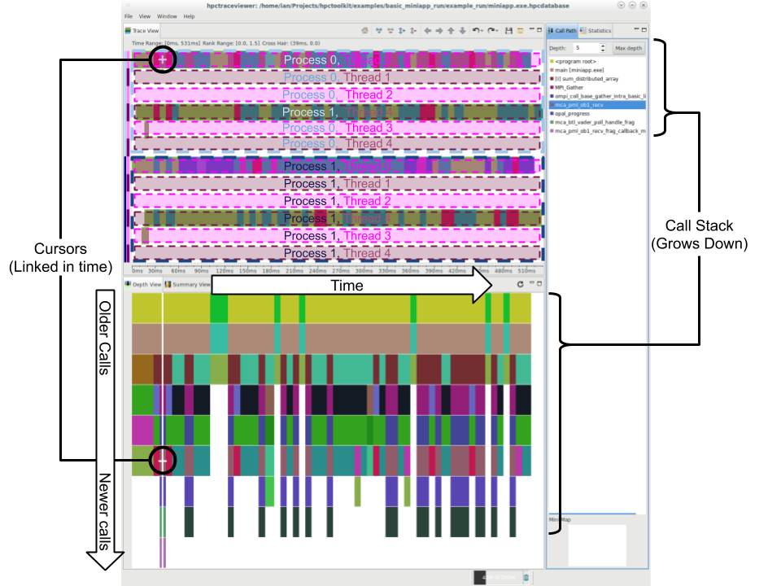
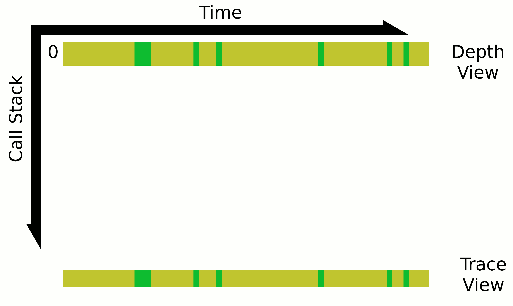

# HPCToolkit Tutorial

This tutorial is a demo geared toward new HPCToolkit users and performance profiling novices.

The demo in this tutorial uses the Miniapp program: a toy distributed stencil computation using MPI and OpenMP (see the [MiniApp readme](miniapp/Readme.md) for more details).


## Table of contents:
- [External Resources](#external-Resources)
- [Quick-start](#quick-start)
  + [Full Build-Run-View](#Full-Build-Run-View)
  + [Quick View](#Quick-View)
- [Getting Started](#getting-started)
  + [Installing HPCToolkit](#Installing-HPCToolkit)
  + [Building the MiniApp](#Building-the-MiniApp)
- [Using HPCToolkit](#Using-HPCToolkit)
  + [Workflow](#Workflow)
  + [Analysis and Profiling](#Analysis-and-Profiling)
    * [Binary Analaysis With HPCToolkit (`hpcstruct`)](#Binary-Analaysis-With-HPCToolkit)
    * [Running Application With HPCToolkit (`hpcrun`)](#Dynamic-Performance-Profiling-Application-With-HPCToolkit)
    * [Building Profile Database (`hpcprof`)](#Building-Profile-Database)
  + [Viewing Profile](#Viewing-Profile)
    * [Source View (`hpcviewer`)](#Source-View-hpcviewer)
    * [Trace View (`hpctraceviewer`)](#Trace-View-hpctraceviewer)
  + [Fair / Unfair Demo](#Fair-Unfair-Demo)
    * [Source View Comparison](#Source-View-Comparison)
    * [Trace View](#Trace-View)
# External Resources
Documentation:
+ [HPCToolkit Manual](http://hpctoolkit.org/manual/HPCToolkit-users-manual.pdf). This should be the go-to source for all questions related to using HPCToolkit software.

Presentations (ordered by most recent):
+ [Profiling with HPCToolkit (2020)](https://www.youtube.com/watch?v=tIsEzzdU0lw)
+ [Profiling With HPCToolkit (2019)](https://www.youtube.com/watch?v=uXRD3PfsaJE)
+ [Analyzing Parallel Program Performance using HPCToolkit (2019)](https://www.youtube.com/watch?v=Y1Ew51tZYOk)
+ [Parallel Program Performance using HPCToolkit (2018)](https://www.youtube.com/watch?v=EEFWNhbA_F8)
+ [Analyzing Parallel Program Performance Using HPCToolkit (2017)](https://www.youtube.com/watch?v=kxgJyRi14pY)
+ [Gaining Insight into Parallel Program Performance: HPCToolkit (2016)](https://www.youtube.com/watch?v=KIlMi05WOyA)
+ [Gaining Insight into Parallel Program Performance: HPCToolkit (2015)](https://www.youtube.com/watch?v=hpANVQeC5F4)
+ [Insight into Parallel Program Performance Using HPCToolkit (2014)](https://www.youtube.com/watch?v=m3e5q7O_yOQ)
+ [Parallel Program Performance Using HPCToolkit (2014)](https://www.youtube.com/watch?v=OUhpfu5NN8Q)

Publications:
+ [Full publiations Listing](http://hpctoolkit.org/publications.html)
+ [Laksono Adhianto, Sinchan Banerjee, Mike Fagan, Mark Krentel, Gabriel Marin, John Mellor-Crummey, and Nathan R. Tallent. HPCToolkit: Tools for performance analysis of optimized parallel programs. Concurrency and Computation: Practice and Experience, 22(6):685–701, 2010.](http://www.hpctoolkit.org/pubs/cpe-2010-hpctoolkit.pdf) [(doi:10.1002/cpe.1553)](https://onlinelibrary.wiley.com/doi/abs/10.1002/cpe.1553)


# Quick-Start

## Full Build-Run-View
To fully build the MiniApp, run a benchmark, and view that benchmark's profiling output, simply run the quick-start script `examples/quickstart/basic_full.sh`.
You should be able to run this from anywhere.

I tried to make both basic_miniapp_run scripts fairly self explanatory.
See [examples/basic_miniapp_run/Readme.md](examples/basic_miniapp_run/Readme.md) for more details.

## Quick View
To skip the build and run parts, you can view a previous run of the basic_miniapp_run example by simply running `examples/quickstart/basic_view_only.sh`.
You should be able to run this from anywhere.

## MiniApp Fair/Unfair Profiles
Alternatively, you can run the analyses defined in the miniapp Makefile (`make analyze`) and view each database (all ending with the `.hpcdatabase` suffix) individually with `hpcviewer <database directory path>` or `hpcviewer <database directory path>`.
(Note that the hpcviewer application does not list the database path, which makes viewing multiple profiles simultaneously difficult.)

`make analyse` runs the  twice using all the same parameters but one: fairness.
One run uses a fair work distribution, and the other runs with an unfair work distribution.

See the [MiniApp readme](miniapp/Readme.md) for more details including how to change the MiniApp run configuration.


# Getting Started


## Installing HPCToolkit
I recommend using the [`spack`](https://spack.readthedocs.io/en/latest/getting_started.html).
The HPCToolkit compilation and test execution software can be installed with `spack install hpctoolkit`
The HPCToolkit visualization software can be installed with `spack install hpcviewer`
It is not necessary to have *both* packages installed on a system if it is only doing performance tests *xor* visualizing runs.


## Building the MiniApp
The miniapp should be easily built with `make -C miniapp build` (or just `make  build` while inside the miniapp directory).
This creates the miniapp executable, `miniapp.exe`
The only dependencies are an MPI installation (I've successfully used OpenMPI 3.1.6 and 1.10.2) and a viable C compiler.
This should work on any Unix-like system.

The [MiniApp readme](miniapp/Readme.md) has a more detailed explanation of the app and build system.


# Using HPCToolkit


## Workflow
Generally, there are 5+ stages involved in profiling an application with HPCToolkit.
1. Compilation.
  Typically this requires nothing more than compililing the application, ideally with debug information enabled.
  For applications that are statically linked, there is some rigmarole involved with linking using `hpclink`, but I have not yet needed to do that (despite having tried this on an application which I'm pretty confident is statically linked with a library the same source defines).
2. Static Binary Analysis.
  Using `hpcstruct` on the program's binary to create an binary analysis of the binary.
3. Execution Profiling.
  Wrapping the execution of the program using `hpcrun` to perform the run-time measurement of the specified performance event(s) or timer event(s).
4. Database Creation.
  `hpcprof`, using the output of the static binary analysis and dynamic performance analysis, along with the program source, creates a performance database


## Analysis and Profiling

### Compiling Applications With HPCToolkit
Compiling applications to be profiled with HPCToolkit does not require a special or separate build process.
I think the only additions that I use (which I'm not even sure are 100% necessar) are the additions of the C/C++ compiler flags `-gdwarf-2 -g3` which (at least for GNU compilers) enable more debugging information that is typically available.

The [HPCToolkit manual](http://hpctoolkit.org/manual/HPCToolkit-users-manual.pdf) discusses the use of `hpclink` for statically linked applications, but I haven't needed that, so I cant give much instruction there.


### Binary Analaysis With HPCToolkit (`hpcstruct`)
Binary analysis is performed on an application with the `hpcstruct` command:
```bash
hpcstruct <application executable>
```

By default, this creates `<application executable>.hpcstruct`.
The analysis output file can be changed with the flag `-o <output file path>`

Below is a complete example of performing the binary analysis on the miniapp and writing the output to `miniapp.exe.hpcstruct` (which happens to be the default name):
```bash
cd miniapp
hpcstruct miniapp.exe -o miniapp.exe.hpcstruct
```


### Dynamic Performance Profiling Application With HPCToolkit (`hpcrun`)
The most basic way to profile an application using HPCToolkit is with the following command:
```bash
hpcrun [HPCToolkit arguments] <application> [application arguments]
```
(8.6.2020 @ian-bertolacci Note:
  This *should* work for *any* application, including those that use MPI, but I'm having trouble getting it to work with the miniapp.
  In any-case, I'm pretty confident that it *use* to work, and invoking with mpirun works, and is how MPI applications should be run anyways.
  So I'm ignoring the issue.)

If the application runs with MPI, we further wrap this with a call to `mpirun` (or `mpispawn`, if you prefer):
```bash
mpirun [MPI arguments] hpcrun [HPCToolkit arguments] <application> [application arguments]
```

By default, this creates a directory `hpctoolkit-<application>-measurements` which contains the measurements data from the run.
(Note: this is not interacted with directly. It is input into the analysis software.)
The output directory can (and should) be changed with the flag `-o <output directory path>`.

By default, tracing is disabled.
To run with tracing enabled (which is necessary to create the trace view, described later), use the flag `-t`.
(8.6.2020 @ian-bertolacci Note:
  I'm not sure why tracing is not enabled by default.
  This makes me think that there could be a difference in the measurements created by hpcrun with/without tracing enabled.
  That's a concerning possibility, but in the worst case, you can just run the application twice with and without the tracing enabled.
  I do not do that, and simple run with tracing every time.)

By default, `hpcrun` measures using CPU time with the CPUTIME timer event.
The event or timer event used can be changed with the flag `-e <event name>`.
Multiple events can be used with multiple flag usages: `-e <event 1 name> -e <event 2 name>.`
The interval or frequency the sampling occurs can be set by the @ operator in the flag after the event.
The period between samples (number of events between a sample of the event) is set with the flag `-e <event name>@<period>`.
The frequency (in samples/second) of sampling the event is set with the flag `-e <event name>@f<frequency>` (note the `f` before the frequency).
The all available/supported events, and descriptions of them, can be listed with `hpcrun -l`.
I think higher frequency is suppose to give more accurate results, but has higher overhead.
I'm not sure how changing the period affects the measurements.
Supposedly mixing certain events and timer events has undesirable side effects.


Note: There are usually permissions issues with most events.
  If there is an error which reads similar to "Failed to initialize the <event name> event.: Permission denied", it is likely that `kernel.perf_event_paranoid` is set too high.
  This can be set with `sudo sysctl kernel.perf_event_paranoid=<level>` or `sudo sh -c 'echo <level> > /proc/sys/kernel/perf_event_paranoid'`, _*but you do so at your own security risk*_.
  The minimum level is probably dependent on what events are being measured, but I think that a level of 2 works, at least for what I tried.
  For UArizona systems, `kernel.perf_event_paranoid` level is (as of 8.6.2020) 1 for Ocelote and 2 for Puma.

Note: I usually run without the frequency/period modifier on the event, largely because I have not been able make heads or tails of the results.
  Leaving it without the modifier seems to produce perfectly fine results.

Below is a complete example which runs the miniapp with 10000 elements and for 10000 iterations, using 2 processes and 2 threads, collecting metrics on the PERF_COUNT_HW_CACHE_MISSES event at a rate of 1000 samples/second, and putting the output in miniapp.exe.hpcmeasurements
```bash
cd miniapp
mpirun -np 2 hpcrun -t -e PERF_COUNT_HW_CACHE_MISSES@f1000 -o miniapp.exe.hpcmeasurements ./miniapp.exe -t 2 -n 10000 -i 10000
```


### Building Profile Database (`hpcprof`)
After having performed the static binary analysis and the dynamic profiling, the profile database can now be created.
This requires access to the source used to compile the application's binary.

The database is created with `hpcprof`:
```bash
hpcprof -S <static binary analysis (hpcstruct) output file> <dynamic profiling (hpcrun) output directory> -I <path to program source>+
```

By default this creates the database directory `hpctoolkit-database`.
This can (and should) be changed with `-o <output directory path>`

The flag `-I` here has a similar meaning to `hpcprof` as it does to a compiler: the argument to the flag is the path to the application's source code directory.
To greatly simplify things, the path to the source code directory can be suffixed with the `+` operator to indicate that the directory should be searched recursively.
Note that this does require the *full* source, and not just the headers (which the compiler's `-I` interacts with).

Below is a complete example which creates the profile database directory miniapp.exe.hpcdatabase using the previously created analysis outputs:
```bash
cd miniapp
hpcprof -S miniapp.exe.hpcstruct miniapp.exe.hpcmeasurements -I ./+ -o miniapp.exe.hpcdatabase
```

## Viewing Profile
There are two views of the profile.
- The code-centric source view (using `hpcviewer`)
- The time-centric trace view (using `hpctraceviewer`)

The source view attaches a value from our event to lines of code.
The call tree can be explored in top-down/bottom-up/flat ways with calls sorted by the value of our events.

The trace view shows a timeline of function calls.

The trace view is useful for getting an overall picture, with the source view being better for more specific investigation and analysis.

The [HPCToolkit Manual](http://hpctoolkit.org/manual/HPCToolkit-users-manual.pdf) has a comprehensive description of the UIs for the viewer applications.

### Source View (`hpcviewer`)
Viewing a database using the source view is done with:
```bash
hpcviewer <path to profile database>
```

In the following description, it may be helpful to open hpcviewer with an existing run.
For example `hpcviewer examples/basic_miniapp_run/example_run/miniapp.exe.hpcdatabase`.

There are two primary sub-panels in hpcviewer
The top is a source code viewer (blank/empty initially )
The bottom is one-or-more sub-panels with tabs

Each tab is a different way of exploring the call-tree.
Each tab has the same columns.
Regardless of measured event, every tab will have a "scope" column.
This lists the functions and their nesting (caller->callees in top-down view, callee->callers in bottom-up view, binary->file->function in flat view
There is also a pair of columns for each measured event, with the event name and units.
The column suffixed with "(I)" is the "inclusive" sum of the events (i.e. the the cost of the function body and *all* of its children's bodies, but only (I'm pretty sure) for times where the child function was actually called by the parent function).
The column suffixed with "(E)" is the "exclusive" sum of the events (i.e. the cost of the body alone, with *none* of its children's bodies).

All columns can be sorted by their values or entry names (in the case of "Scope").

There are also :
+ `<program root>`: Denotes function called under the program entry point (i.e. `main`)
+ `<thread root>`: Denotes function called under some arbitrary thread spawn function (such as `gomp_thread_start`).
In the top-down view, these are the roots of the caller->callees nesting.
In the bottom-up view, these are the leaves of the callee->callers nesting.
They are not present in the flat view.

Each entry in the scope lists the function name, and the line where it is called.
If `hpcprof` had access to the source of the caller function (which it should for main application profiles), then the line number is a clickable link which will move your source view (the sub-panel above the tabs) to the function invocation.
If `hpcprof` had access to the source of the callee function (which it should for functions in the main application for main application profiles), then the function name is a clickable link which will move your source view to the functional definition (I'm not sure where it goes if the declaration and definition are in different locations).

Alternatively, the entry may be a "loop", which is a loop at the line in the specified source.
Similarly to function calls, if the profiler had access to the source with this loop, the name is a link to loop source.

Typically, I use the exclusive sum to find problematic sections of code, and the inclusive sum to determine the actual root cause.

To quickly find the *hottest* path (e.g. the hottest function), go to the Top-down tab, select a column whose value will be used (I suggest CPUTIME (I)), make sure it is descending sorted (down arrow next to the column name), click "<program root>" (or "<thread root if you want>"), then click the flame icon at the top of the sub-panel.
This will quickly expand the tree to deepest function in the callpath with the highest cost (when column sorted descending; lowest when column sorted ascending)
This also works in Bottom-up mode to find the root of a hot-path
However, I am not sure how to find the *next* hottest path.
This tool can also be used on subtrees, to find the hottest path of the selected entry as opposed to the hottest path of the whole program.


### Trace View (`hpctraceviewer`)
Viewing a database using the source view is done with:
```bash
hpctraceviewer <path to profile database>
```
Note: the database must have been created with measurements taken with with tracing enabled for hpcrun (`hpcrun -t`)

The trace view show a multi-dimensional view programs call-stack over time across all processes and threads.
This can shed light on sequences and phases of execution.

In the following description, it may be helpful to open hpctraceviewer with an existing run.
For example `hpctraceviewer examples/basic_miniapp_run/example_run/miniapp.exe.hpcdatabase`.

There are 3 main sub-panels to focus on:
+ Trace view: 2.5D view (functions across all time and all process/threads) of whole execution.
  Time on horizontal axis, processes (outer grouping; in alternating light/dark blue) and threads (inner grouping; in alternating light/dark pink).
  Cursor (cross-hair) is the point in time and the process/thread used for all other views all other panels.
  Color indicates function (as labeled on Call-Path panel) *at most* as deep as the current depth (as indicated in call path depth and depth view cursor)
+ Call Path tap: Call stack at this point in time for the particular process/thread.
  Selected call changes the call depth for the trace and depth views.
  The "Max depth" button will set the depth to the deepst point for all threads/processes at any point in time

+ Depth view tab: 2D view (function stack across all time) of the execution of one thread in a process.
  Time on horizontal axis (matching trace view), call stack on vertical axis (call path matches this view at the current time position)
  Color indicates function (as labeled on Call-Path panel) at the particular depth (as indicated in call path depth and this view's curor).
  Cursor (tall cross-hair) is the time (vertical tall part of cursor) and depth (short horizontal part of cursor).

 There are also these tabs/sub-panels which I am less familiar with:
+ Statistics tab: Percentage of the total time a function (or none at all) a function is running.
  Fully independent of time and process/thread.
+ Summary view tab: 2.5D view (functions across all time and all processes) which is basically the trace view, butstacked (that's the best I can explain this without just copying the manuag. Maybe [this](https://www.smashingmagazine.com/2017/03/understanding-stacked-bar-charts/) or [this](https://python-graph-gallery.com/stacked-area-plot/) helps illustrate what I'm saying).


Below is a visual breakdown of the trace view


The trace view can be somewhat complicated to understand.
The functions displayed in that view are the functions which are *at most* at the depth selected.
This is explained further, but the below animation demonstrates how, as the depth changes, the trace view changes.


As an example, if a process/thread's call-stack at time `t` is `[ foo, bar, baz ]` (`foo` the the oldest call in this list) and the depth is depth 0, then `foo` will be displayed at that point in time for that process/thread, since the other calls are deeper than foo.
If the depth is 1, then `bar` will be displayed.

Taking this further, if there are two threads with the following call stacks at time `t`:
+ thread 0: `[ foo, bar, baz]`
+ thread 1: `[ buzz, fizz]`
And the depth is 0, then `foo` and `buzz` are displayed.
If the depth is 1, then `bar` and `fizz` are displayed.
However if the depth of 2, then `bar` and `fizz` are displayed, because thread 1 has no deeper functions.
This is extended for the time axis, where the stack is changing in a thread over time.


The there is also


# Fair / Unfair Demo
The MiniApp can be configured to run with to work distributions:
- Fair: Each rank owns (and works on) `floor(N/processes)` elements of the distributed array, with the primary rank taking on the remainder (for a total of f`loor(N/processes) + N % processes` elements).
  This is a fair distribution.
  + `miniapp -d fair <other args>`
- Unfair: Each process owns (and works on) an amount of work such `sum( rank id in range(process), (rank id +1 )*work[rank]) == N`.
  This is to say, that the work is divided into `sum(processes)` pieces, and each rank gets `rank id + 1` of those.
  This is unfair, as ranks with lower rank ids get less work, and the higher rank ids get a lot more work.
  + `miniapp -d unfair <other args>`

The directory [examples/miniapp_UArizona_Puma](examples/miniapp_UArizona_Puma) has dozens of previous runs using the fair/unfair distribution across a range of sizes and iterations.

In this section, we will use the profile databases for run with 4 processes and 24 threads with 10^8 elements for 100 iterations in the fair and unfair distribution cases measuring CPUTIME ( [examples/miniapp_UArizona_Puma/miniapp.exe_fair_procs-4_threads-24_n-elts-100000000_n-iters-100_trace-yes_CPUTIME_metric-db-no.hpcdatabase](examples/miniapp_UArizona_Puma/miniapp.exe_fair_procs-4_threads-24_n-elts-100000000_n-iters-100_trace-yes_CPUTIME_metric-db-no.hpcdatabase), and [examples/miniapp_UArizona_Puma/miniapp.exe_unfair_procs-4_threads-24_n-elts-100000000_n-iters-100_trace-yes_CPUTIME_metric-db-no.hpcdatabase](examples/miniapp_UArizona_Puma/miniapp.exe_unfair_procs-4_threads-24_n-elts-100000000_n-iters-100_trace-yes_CPUTIME_metric-db-no.hpcdatabase) respectively)

Alternatively, you can use another pair of fair-unfair runs (so long as they have the same execution parameters otherwise) and follow along.

## Source View Comparison
First, we will see what the difference is in the call-graphs between the two.
Open the fair database with hpcviewer (`hpcviewer examples/miniapp_UArizona_Puma/miniapp.exe_fair_procs-4_threads-24_n-elts-100000000_n-iters-100_trace-yes_CPUTIME_metric-db-no.hpcdatabase`).
Note the sub-panel with the tabs "Top-down view", "Bottom-up view", and "Flat view".

Add the unfair database with File->Open database, and opening the unfair database folder (`examples/miniapp_UArizona_Puma/miniapp.exe_unfair_procs-4_threads-24_n-elts-100000000_n-iters-100_trace-yes_CPUTIME_metric-db-no.hpcdatabase`).

This makes a *second* sub-panel with the same of tabs, but now all the tabs are prefixed with a number (and suffixed with the executable name which is the same for both sets).
On the left are the tabs for the fair run, prefixed with "1" and on the right are the tabs for the unfair run prefixed with "2".
Currently, hpcviewer does not list the database path anywhere, so you will have to keep these two straight in your mind.

To view the databases metrics side-by-side, we can merge the top-down view with File->Merge databases->Merge top down databases.
Note: I'm *pretty sure* that this *will not* modify the database files.
This creates a new sub-panel with a single tab: "Top-down view (miniap.exe & miniapp.exe)"
It has the following columns:
+ "Scope",
+ "1-CPUTIME(sec):Sum (I)": the *in*-clusive CPUTIMES from the fair run
+ "1-CPUTIME(sec):Sum (E)": the *ex*-clusive CPUTIMES from the fair run
+ "2-CPUTIME(sec):Sum (I)": the *in*-clusive CPUTIMES from the *un*-fair run
+ "2-CPUTIME(sec):Sum (E)": the *ex*-clusive CPUTIMES from the *un*-fair run

While this is useful, we can also create a derived metric which will be the raw difference in total duration (inclusive) a function ran during the fair run vs the unfair run.
+ Click on the 'f(x)' icon in the "3-Top-down view".
  This will open a "Creating a derived metric" window.
+ In "Name" (the column name), enter "Diff CPUTIME(sec) (I) (Unfair - Fair)".
To enter our formula, we'll use the Assistance sub-panel.
+ From the "Metrics" dropdown, select "2-CPUTIME (sec):Sum (I)" (the unfair run's inclusive CPUTIME column).
+ Then click "Point-wise".
  This will insert a point-wise column variable into the Formula (probably something like `$210`).
+ Then enter "-" (for minus) after the variable inserted by what we just did.
+ Then from the "Metrics" dropdown, select "1-CPUTIME (sec):Sum (I)" (the fair run's inclusive CPUTIME column).
+ Then click "Point-wise" to insert the point-wise column variable into the Formula.
  If the columns inserted by "Assistance" got out of order somehow, fix them; its just a simple equation.

Then click "OK" at the bottom of the "Creating a derived metric" window.

This will add the "Diff CPUTIME(sec) (I) (Unfair - Fair)" column to the "3-Top-down view" tab (it will be the last column; you may have to scroll to find it).

Now we can see how much more (or less) time the unfair run took in comparison to the fair run.
First, looking at Sigma  Experiment Aggregate Metrics (sum of whole column) entry in the "Diff CPUTIME(sec) (I) (Unfair - Fair)" colum, it should show a difference in total time of 139 (1.39*e+2, which about matches (with limited precision) a simple subtraction of the "1-CPUTIME(sec):Sum (I)" from "2-CPUTIME(sec):Sum (I)" (3.93*10^3 - 3.79*10^3 = 1.4*10^2).

Using the "hotpath" tool and our derived column, we can find the call path that adds the most time to the unfair runtime.
Select "Diff CPUTIME(sec) (I) (Unfair - Fair)" in descending mode (click the column name; if the arrow is an up arrow (ascending), click name again to make it go down (descending)), click "<program root>", and then click the flame icon.

This should expand the following path
+ `<program root>`
  - `main`
    * `loop at miniapp.c:945`
        + `950: sum_distributed_array`
          - `895: MPI_Gather [libmpi.so.40.10.4]`
            * `ompi_coll_base_gather_intra_basic_linear [libmpi.so.40.10.4]`
                + `mca_pml_ob1_recv [mca_pml_ob1.so]`
                  - `__sched_yield [libc-2.17.so]`
                    * `<unknown file> [libc-2.17.so]`

Now, this is capturing information about *internal* MPI calls, which we have no control over and thus don't care about, so lets focus on this path with times Fair inclusive CPUTIME (%), Unfair inclusive CPUTIME (%), Unfair - Fair inclusive CPUTIME
+ `main`: 1.72e+02s (4.6%), 1.81e+02s (4.6%), 8.77e+00s
  - `loop at miniapp.c:945`: 1.50e+02s (4.0%), 1.60e+02s (4.1%), 1.01e+01s
    * `950: sum_distributed_array`: 4.69e+01s (1.2%), 5.29e+01s (1.3%), 6.00e+00s
      + `895: MPI_Gather [libmpi.so.40.10.4]`: 2.76e-01s (0.0%), 2.97e+01s (0.8%), 2.95e+01s

This tells us that we are spending 29.5 (2.95e+1) *more* seconds performing the Gather section of the distributed array summation in the unfair case than the fair case.
Now, HPCToolkit can't tell us *why* that's happening, but it is a good place to start.

The 29.5 seconds does not account for the 139 additional seconds of time, so lets look around for some more time.
We're currently under `sum_distributed_array`, with `MPI_Gather` at +29.5 seconds but `sum_local_array` at -23.5 seconds, so the additional time comes from somewhere not under the `sum_distributed_array` call-tree.

Going to its sibling call, `in_place_stencilize_distributed_array`, we can select it and use the hotpath tool again, giving this path:
+ ` main` : 1.72e+02s (4.6%), 1.81e+02s (4.6%), 8.77e+00s
  - `loop at miniapp.c:945` : 1.50e+02s (4.0%), 1.60e+02s (4.1%), 1.01e+01s
    * ` 950: sum_distributed_array` : 4.69e+01s (1.2%), 5.29e+01s (1.3%), 6.00e+00s
      + `947: in_place_stencilize_distributed_array` : 1.03e+02s (2.7%), 1.07e+02 (2.7%), 4.08e+00s
        - `822: MPI_Wait [libmpi.so.40.10.4]`: 2.71e+00s (0.1%), 1.62e+01s (0.4%), 1.35e+01s

This tells us that the we are spending 13.5 (1.35e+01) *more* seconds performing the Wait call at line 822 of the distributed array stencil operation in in the unfair case than the fair case.

Again, HPCToolkit can't tell us *why* that's happening.
However, this behavior is indicative of (among about 10,000 other things) the kind of distributed load balance issue, the likes of which we've created artificially with our unfair work distribution scheme.


## Trace View


Getting back to the fair/unfair example, lets look at the fair database.
Open the fair database with hpctraceviewer (`hpctraceviewer examples/miniapp_UArizona_Puma/miniapp.exe_fair_procs-4_threads-24_n-elts-100000000_n-iters-100_trace-yes_CPUTIME_metric-db-no.hpcdatabase`)
